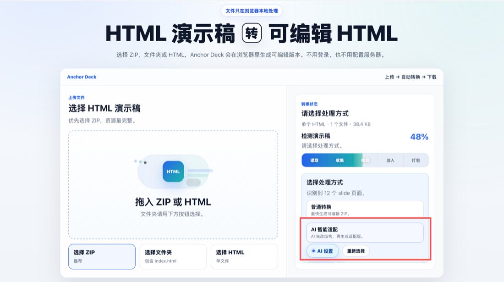
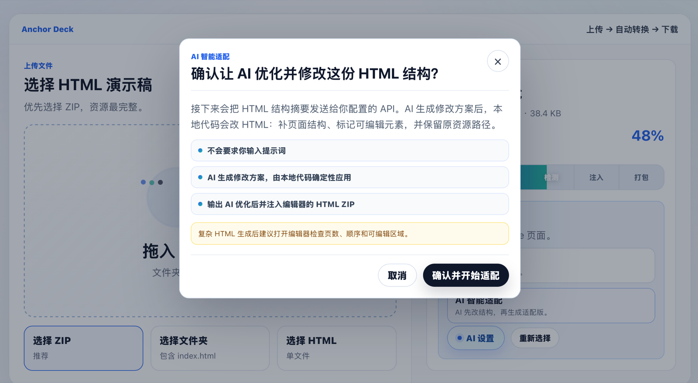
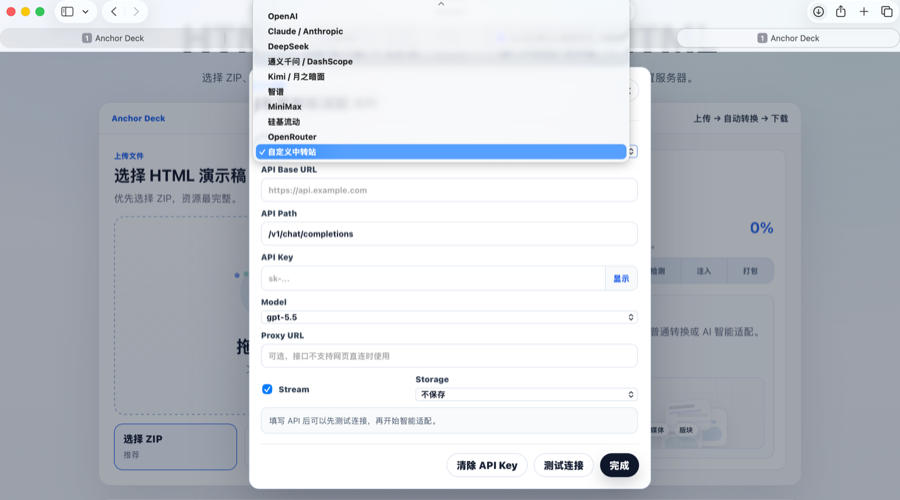

# Anchor Deck

**把“能看”的 HTML 演示稿，变成“还能继续改”的本地 deck。**

Turn AI-generated HTML presentations into editable local decks.

[在线体验](https://wengzige.github.io/html-deck-editor/) · [English](README.en.md) · [结构契约](docs/html-deck-contract.md) · [隐私说明](docs/privacy.md)

  

```text
上传 HTML / ZIP / 文件夹
  -> 自动识别页面
  -> 可选 AI 智能适配
  -> 生成可编辑 ZIP
  -> 打开 index.html，按 E 编辑
```

AI 很会生成漂亮的 HTML slides，但后续改字、换图、挪布局通常很痛苦。Anchor Deck 解决的就是这一步：上传、适配、下载，然后直接在浏览器里继续编辑。

> 新版已加入 AI 智能适配：复杂 HTML 可以先由 AI 帮助识别页面结构，再由本地转换器写入编辑器标记。



## 亮点

- **本地优先**：文件默认只在浏览器里读取、改写和打包。
- **一键转可编辑**：上传 HTML / ZIP / 文件夹，下载新的可编辑 ZIP。
- **AI 智能适配**：复杂 HTML 可以先用 AI 识别页面、文本、图片和视觉块，再生成更适合编辑器的结构。
- **保留原资源**：尽量保留原始 CSS、JS、图片、字体和相对路径。
- **静态文件输出**：生成结果仍然是普通 HTML，可保存、转发、托管。
- **BYOK AI**：使用你自己的 API Key，支持 OpenAI-compatible 接口和可选代理。
- **for-ai.md 交接**：在编辑器里给元素写批注，一键导出给外部 AI 的修改上下文。
- **字体库与字体导入**：内置常用中文字体栈，可选联网开源字体，也可导入 WOFF2 / WOFF / TTF / OTF。
- **PDF / 图片导出**：自由勾选页面，导出 PDF、PNG 或 JPG；多页图片自动打包 ZIP。

## 重磅更新：AI 智能适配

很多 HTML deck 并不是标准幻灯片结构：页边界不清晰，文本和装饰层混在一起，图片、SVG、Canvas 不容易被编辑器选中。现在可以在转换前点击 **AI 智能适配**，让 AI 先帮助 Anchor Deck 理解这份 HTML，再由本地转换器写入编辑器需要的结构标记。



AI 智能适配会帮你完成这些事：

- 识别幻灯片页面、顺序和页面标题。
- 找出可编辑文本、媒体元素和视觉块。
- 给页面补 `.slide` / `data-title`，给文本补 `data-editable`。
- 给图片、视频、SVG、Canvas 等补媒体编辑标记。
- 跳过导航、按钮、装饰层等不适合编辑的区域。
- 标出需要复核的风险点，例如页数、顺序、媒体识别不足。
- 生成 AI 结构优化预览，用户确认后才输出可编辑 ZIP。

这套流程把 AI 用在“理解复杂 HTML”上，再由本地转换器校验 selector、写入标记、保留资源并完成打包。它能显著提升复杂 HTML 的适配成功率；遇到结构特别混乱或只有整页截图的文件时，仍建议在预览里复核页数、顺序和可编辑区域。

## 给 AI 的修改交接：for-ai.md

转换后的 deck 里也可以继续和外部 AI 协作。进入编辑模式后，选中页面里的文字、图片或视觉块，在右侧 **AI 批注** 写下修改意见，然后点击 **导出 for-ai.md**。

这个文件会包含：

- 当前 HTML 的可编辑结构。
- 用户写在具体元素上的批注。
- 元素 anchor、所在页面、目标描述和内容片段。
- 给 AI 的修改要求，例如保持 `deck-stage` / `.slide` 层级、保留可编辑文本和资源路径。

`for-ai.md` 适合发给 Codex、Claude、ChatGPT 或其他 agent，让它们按批注继续小范围修改 HTML。导出它不会保存 HTML，也不会把批注标记混进正常导出的页面。

## 字体与 PDF / 图片导出

进入编辑模式并选中文字后，右侧字体菜单分为：

- **本机常用字体**：黑体、宋体、仿宋、楷体、苹方、微软雅黑，以及常用英文和等宽字体栈。
- **联网字体**：思源黑体、思源宋体、霞鹜文楷、站酷小薇体。选择后会访问固定版本的 jsDelivr CDN；字体授权以 OFL 1.1 和各字体项目说明为准。
- **已导入字体**：支持 WOFF2、WOFF、TTF、OTF，单个文件不超过 20MB。字体以 Data URL 嵌入 HTML；刷新前请先点 **保存 HTML**，否则需要重新导入。

工具栏的 **导出 PDF / 图片** 可以选择当前页、全选、取消全选或逐页勾选。PDF 一页对应一张幻灯片；PNG / JPG 单页直接下载，多页自动生成 ZIP。图片按 2 倍分辨率渲染，JPG 质量为 0.92。导出前会等待字体和页面资源；如果某一页的跨域图片无法读取，会提示具体页码并停止导出，避免生成缺图文件。

## 适合谁

Anchor Deck 适合这些场景：

- 你用 AI agent 生成了一份 HTML 汇报页，但后面还想手动微调。
- 你有一套 HTML slides，需要交给非技术同事改文字、图片和布局。
- 你想把静态 HTML 演示稿做成可编辑交付物，而不是一次性页面。
- 你正在做 AI PPT / HTML deck 工作流，需要一个“生成后可编辑”的落地点。

## 在线使用

打开：

[https://wengzige.github.io/html-deck-editor/](https://wengzige.github.io/html-deck-editor/)

推荐上传：

| 输入 | 说明 |
| --- | --- |
| ZIP | 最推荐。包含 `index.html`、图片、CSS、JS 等完整资源 |
| 文件夹 | 本地完整 HTML 演示项目，里面包含 `index.html` |
| 单个 HTML | 没有外部资源依赖的简单演示稿 |

转换后：

1. 下载可编辑 ZIP。
2. 解压。
3. 打开 `index.html`。
4. 按 `E` 进入编辑模式。
5. 修改文字、图片和布局。
6. 保存或下载修改后的 HTML。

## AI API 配置

AI 智能适配采用 BYOK（Bring Your Own Key）方式。你只需要在页面里配置一次 API：



- Provider：OpenAI-compatible、OpenAI、Claude / Anthropic、DeepSeek、通义千问、Kimi、智谱、MiniMax、硅基流动、OpenRouter、自定义中转站。
- API Base URL、API Path、Model、Stream 都可以手动修改。
- 支持可选 Proxy URL，用于处理不允许浏览器直连的接口。
- API Key 默认不长期保存；可选择仅本次会话保存或保存到当前浏览器本机。

如果某个服务商或中转站不支持浏览器 CORS 直连，可以换支持网页调用的接口，或填写自己的代理地址。

## 什么 HTML 更容易编辑

更容易被识别和编辑的 HTML 通常有这些特征：

- 多个 `section` 页面。
- Reveal.js 演示结构。
- 固定舞台结构，例如 `<deck-stage id="deckStage">`。
- 标题、正文、数字、标签是真实 HTML 文本。
- 图片、图表、形状拆成独立元素。
- 资源用相对路径放在项目目录里。

不太适合直接上传：

- `.pptx`、`.pdf`、`.key`。
- React、Vue、Next 等需要构建的源码工程。
- 普通长网页或 Web App。
- 只有整页截图、没有可编辑 HTML 内容的演示稿。

## 给 AI 的生成提示词

如果你希望 AI 生成的 HTML 更适合后续用 Anchor Deck 编辑，可以直接复制这段：

```text
请生成一份适合后续用 Anchor Deck 编辑的静态 HTML 演示稿，主题是「这里填写主题」。

结构要求：
- 输出完整 index.html，可以直接在浏览器打开。
- 使用 16:9 固定画布，推荐 1920x1080。
- 只使用一个顶层演示舞台，优先使用：
  <deck-stage id="deckStage" width="1920" height="1080">
    <section class="slide active visible" data-title="封面">...</section>
    <section class="slide" data-title="第二页">...</section>
  </deck-stage>
- 如果不用 deck-stage，也必须使用一个明确的外层容器，例如：
  <div id="deck" data-deck data-design-width="1920" data-design-height="1080">...</div>
- 每一页必须是舞台的直接子元素：<section class="slide">。
- 不要把 .slide 用在卡片、图片框、动效块、列表项或任何页内元素上。
- 不要在 slide 里面再嵌套 section.slide。
- HTML 标签必须完整闭合。

可编辑性要求：
- 标题、正文、数字、图表标签、页脚等必须是真实 HTML 文本。
- 重要文字、图片、图表、形状尽量拆成独立元素，便于选中和移动。
- 图片、视频、字体、脚本等资源使用相对路径，统一放在 assets/ 目录。
- 不要依赖登录态、后端接口或必须联网加载的核心资源。
- 可以使用少量原生 JavaScript 做翻页或动画，但不要在脚本里删除或重新生成 slide DOM。
```

短版：

```text
请生成一个完整静态 HTML 演示稿。必须只有一个 <deck-stage id="deckStage" width="1920" height="1080"> 或 <div id="deck" data-deck> 舞台；每页必须是舞台的直接子元素 <section class="slide" data-title="...">；不要在页内任何元素使用 .slide；不要让任何 section.slide 出现在舞台外；标签必须完整闭合。所有文字保留为真实 HTML 文本，图片和资源放 assets/ 相对路径，不要生成长网页、Web App 或需要构建的项目。
```

## 隐私与安全

- 文件默认只在浏览器本地处理。
- 项目不会内置作者 API Key。
- AI 适配只在用户配置 API 后才会调用用户选择的服务商或代理。
- API Key 默认不长期保存。
- AI 调用只发送必要的 HTML 结构摘要，不默认发送图片二进制或完整资源包。
- 只有用户主动选择联网字体时，页面才会访问外部 jsDelivr CDN；本地导入字体和 PDF / 图片导出都在浏览器内完成。

## 开源范围

本仓库公开的是 Anchor Deck 的核心转换器、文件检测、打包逻辑，以及注入到演示稿中的浏览器编辑器 runtime。线上网站的页面外壳源码目前不随 `main` 分支开源；GitHub Pages 只发布构建后的静态产物。

## 本地开发

```bash
npm install
npm test
npm run typecheck
```

代码结构：

```text
src/lib/        文件读取、检测、HTML 改写、AI 适配和打包逻辑
src/runtime/    注入到演示稿中的浏览器编辑器运行时
src/types/      核心类型定义
src/test/       转换、检测、AI 配置、文件读取和运行时测试
docs/           HTML deck 结构契约
```

## License

Anchor Deck 采用 [MIT License](LICENSE) 开源。使用、复制、修改、分发、再授权或销售本项目的副本时，必须保留版权声明和许可文本。

本许可适用于本仓库中公开的源码、文档和示例；它不代表授予未随 `main` 分支公开的网站外壳源码，也不允许移除作者署名、隐瞒本项目来源或冒充原作者。

这个项目复用了 `frontend-slides` 的编辑器 runtime 思路和部分代码，已在 [NOTICE.md](NOTICE.md) 保留署名和许可说明。第三方组件仍遵循各自许可。
